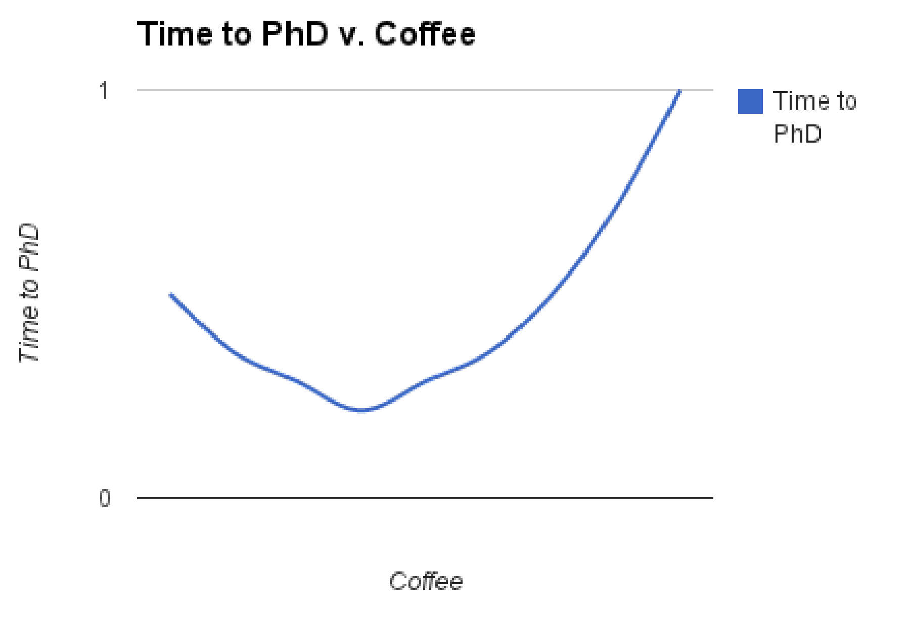
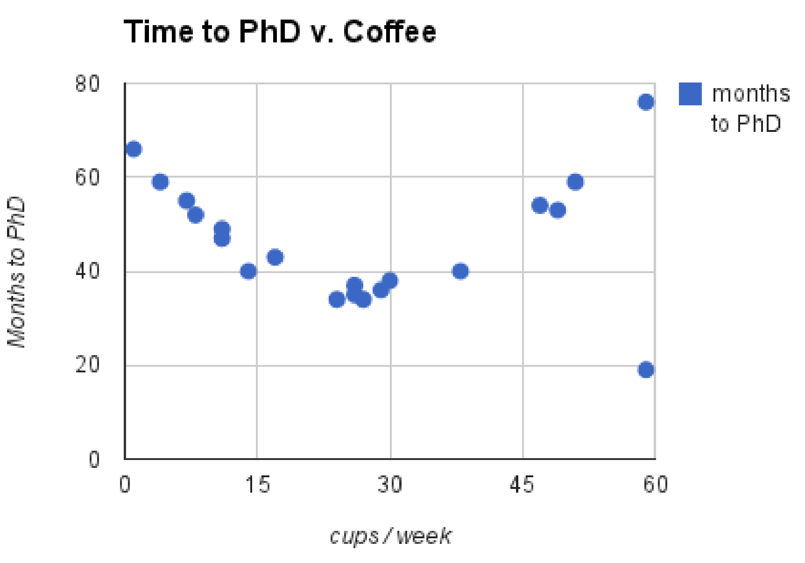

# **how to set up an experiment**

One of the key skills I learned during my PhD was how to set up experiments with specific, testable hypotheses.
I was taught a simple, systematic protocol that was easy to follow and translates easily to an experimental outline for a research paper.
Here is a simple example of this protocol - and yes, it is strikingly similar to the basic scientific method we learned in grade school.

*The remainder of this post has circulated in the [HazyResearch lab](https://hazyresearch.stanford.edu/) for years, first as a Google doc, then as a web page maintained by Chris Aberger, and now in the form you see here. The identit(ies) of the original author(s) has been lost to history, but they should get all the credit. At the end are some common pitfalls to avoid that I've seen come up in my own research and from watching people apply this protocol - I hope it's helpful!*

The key ideas of this protocol:
* **Hypothesis**: We have a specific hypothesis about the world that we'd like to test.
* **Proxy**: We use a measurable quantity as a proxy for the thing we care about.
* **Protocol**: We describe in detail how we will collect data to test our hypothesis.
* **Expected Results**: We describe what we expect to see if our hypothesis is correct.
* **Results**: We present and analyze the actual results we collected.

And last but not least - **when the results do not match our expectations, we take a closer look to understand what's happening** - that's how we find the interesting stuff!

## **the coffee experiment!**

#### **hypothesis**

Caffeine makes graduate students more productive.

#### **proxy**

To measure the productivity of graduate students, we use the time it takes to complete their PhD as the proxy.
To measure the caffeine that each student takes, we use the number of cups of coffee a students drinks as the proxy.
Note that we do not count caffeine that comes from other sources such as tea or soda.

#### **protocol**

Out of the 100 students in our school, have them report the mean cups of coffee they drank throughout their PhD.
Also, record the date they start their PhD and the date they get their PhD.
Only consider students who have left the school with a PhD.

Note that if a student is very productive, but dies of caffeine toxicity days before they finish their PhD, they will not be counted.

Note that since we record mean cups of coffee per week, we do not capture information about increases or decreases throughout their PhD.

#### **expected results**

We expect that:
* Students without caffeine take a long time to get their PhD
* Students who drink a lot of caffeine finish their PhD very quickly
* Drinking too much caffeine would cause caffeine toxicity and would lengthen the time to get a PhD due to psychosis

In short, we expect a convex cuve like the one below:

Since it is convex, this implies there is some optimal amount of coffee to drink to minimize the time spent working on a PhD.

#### **results**

The results match our expected results.
We observe that the knee of the curve is at approximately 30 cups of coffee per week with a PhD in 36 months; this seems to be the optimal amount of coffee to drink to be a productive graduate student.

Note that there seems to be an outlier who drinks about 60 cups of coffee a week but finished their PhD in 19 months.
We tracked down this student and found out that they drink 5 large iced Americanos a day.
Upon further testing, we discovered that this student is immune to caffeine toxicity.

## **common pitfalls**
The above experiment is intentionally cheeky (I don't recommend drinking 30 cups of coffee a week!), but I find it's helpful to reason about some common pitfalls.
Here are a few I've observed - both in my own research and from watching others apply this protocol over the years.

#### **have a specific hypothesis**
This coffee experiment is very specific in what it attempts to measure - it's only the relationship between cups of coffee and time to PhD.
Note what it does not measure - it doesn't measure happiness, or how many papers a student writes, or how impactful their work is.

A common pitfall is to have a hypothesis that is too vague or too broad.
For example, this would be a bad hypothesis:

**Caffeine makes people better human beings.**

Clearly, this hypothesis would be too broad to test given our protocol above!

In real research papers, this pitfall often reads like "our method X makes Y better" without being specific about what "better" means.

#### **have a falsifiable hypothesis**
A good hypothesis should be falsifiable - there should be an experimental outcome that can clearly disprove it.
That's why it's important to write down what your expected results are **before** you run your experiment - that forces you to write down how your experimental setup will support or disprove your hypothesis.

This would be an example of a non-falsifiable hypothesis:

**Drinking caffeine is a good idea.**

This hypothesis is impossible to falsify - there is no experimental outcome that can clearly disprove it, since you can always find some person who thinks drinking caffeine is a good diea.

In real research papers, this pitfall often reads like opinionated statements about why method X is the "right" way to do something.

#### **proxies and protocols are always imperfect**
The above experiment uses an intentionally simple proxies for "caffeine" and for "productivity."
You probably noticed this from the setup - we don't count caffeine from tea or soda, and we only count time to PhD as a proxy for productivity.
There are a number of problems with these proxies.

But **proxies are always imperfect** - we can't always measure exactly what we want to.
The important bit is to be aware of the limitations of your proxies and to choose them with intention.

The same idea applies to protocols.
You'll notice that the coffee experiment does not measure variation in caffeine intake throughout the PhD, and it has some pretty glaring flaws like not accounting for students who drop out (or die of caffeine toxicity).
**Experiment protocals are always imperfect** - what's important is being aware of the imperfections to account for them.

In a real research paper, you may choose to strengthen the power of your argument by running a separate experiment that uses different proxies and protocols with other tradeoffs.

#### **dig in when you find unexpected results**
One of my advisors likes to say "pay extra attention when you find an unexpected result, because it's either a bug or it's the big result."

In the coffee experiment, we found an unexpected result - one student who drank a lot of coffee finished their PhD in 19 months, when our prediction and the trend line suggested it would take them a lot longer.

When you find results like this, it's extra important to dig deeper to understand what's happening.
There's two major possibilities that you want to catch:

**There's a bug in your code/protocol/design.**

In the coffee experiment, maybe we mis-measured how many cups of coffee that student drank.

**There's a big result.**

In the coffee experiment, we discovered that someone is immune to caffeine toxicity.
In a real research paper, this could be the next big thing!
You may be surprised how often this happens - you're going after one thing and discover something much bigger along the way.

In summary - **look at your data, and dig in to the weird edge cases.**

## **conclusion**

In conclusion - the coffee experiment is a simple template for setting up experiments.

The key ideas are:
* Write down a specific, falsifiable hypothesis.
* Come up with a measurable proxy for the hypothesis. Be aware of how it is imperfect.
* Describe a protocol for measuring your proxy.
* Write down your expected results.
* Compare your actual results to your expected results. Dig in when the expected results do not match the actual results.

Happy experimenting!

*Last updated 11/27/2024.*
